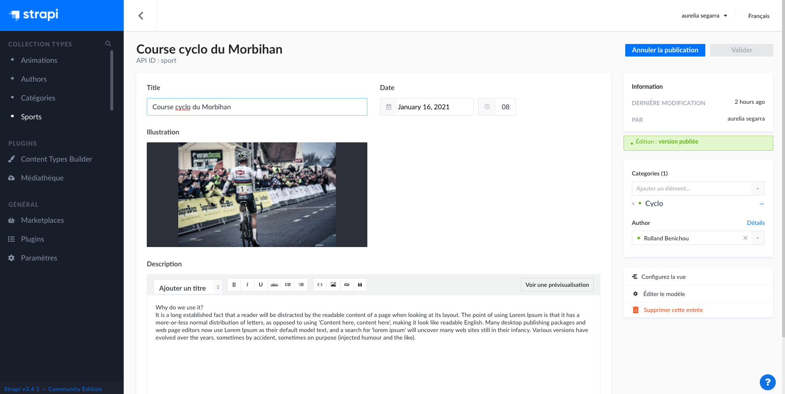

# :rocket: Discover Strapi 

## What is Strapi ? Headless CMS and what can I do ? Let's go!

## Illustration

## Language/Tools
- Strapi
- javascript / React
- PostgreSQL
- Node
- API RESTful

## Goals 
- Creation of a database with user. Discovering strapi and its features to build a fairly simple site for a media - a blog with articles that can have an author and can belong to several categories.

## Status
Project not completed

## Context
Project carried out during my training as a web developer